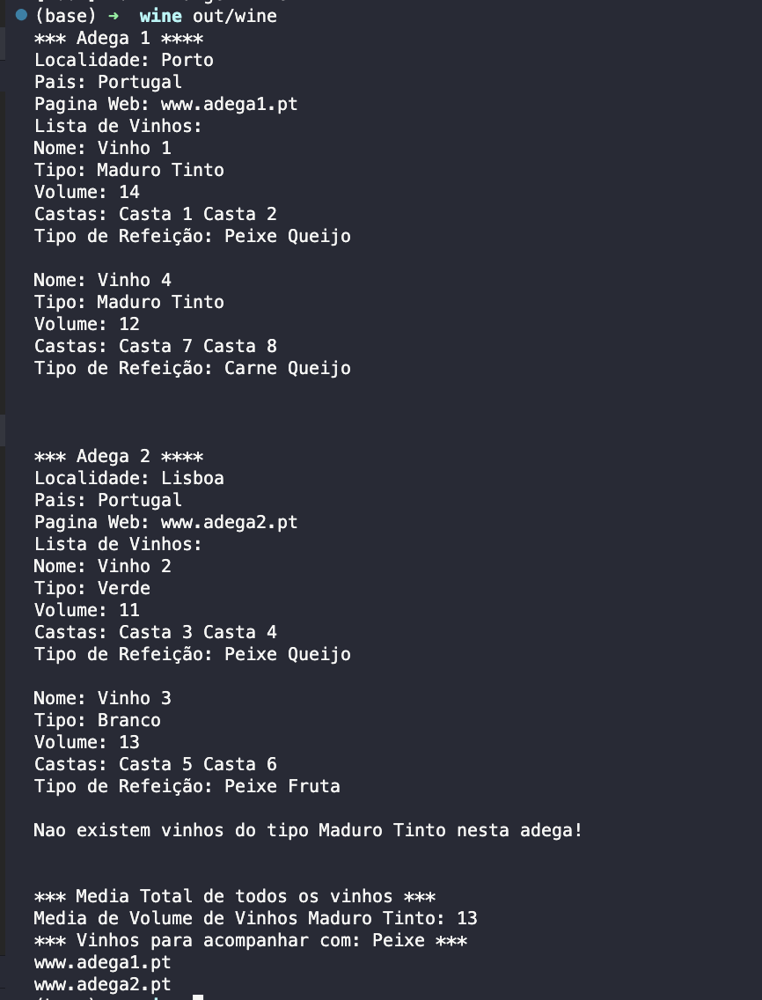

<h1 align="center">
    
</h1>

efolio Global de Programação por objetos - 21093 da UAb - Recurso

Fica aqui a minha versão para mostrar aos colegas que foram a recurso, as boas practicas na linguangem C++17

📌 Programa Wine
------------------
As adegas podem produzir uma ou mais marcas de vinho, podendo ser de tipos diferentes. As adegas são caracterizadas por nome, localidade, país e página web, enquanto os vinhos têm nome, tipo, lista de castas, lista de tipos de refeições que devem acompanhar e volume de álcool.
Esta questão será avaliada da seguinte forma:

a) Declaração das classes, métodos e relações para definir cada objeto existente no enunciado corretamente (ficheiros .h) 

b) Utilização de containers e iterators para gerir os dados onde necessário 

c) Definição detalhada dos métodos necessários para (ficheiros .cpp):
- Considerando o tipo “maduro tinto”, calcule a média de volume de álcool dos vinhos deste tipo, e grave no ficheiro “suaves.txt” todos os nomes e respetivos volumes de álcool dos vinhos que se encontram abaixo dessa média; (2 pontos)
- Encontre todas as adegas que produzem vinhos que devem acompanhar pratos de peixe, e escreva no ecrã o URL da respetiva página web; 
Não se esqueça de incluir os #includes necessários nos ficheiros .h.
 
Para compilar colocamos na pasta principal o ficheiro CMakeLists e no terminal escrevemos: 
 
<strong>cmake -S . -B out</strong> 
<strong>cmake --build out</strong> 
 
<strong>OU</strong> 
 
<strong>cmake -S . -B out</strong>  
<strong>cd out </strong> 
<strong>make</strong> 

 

🔧 Tecnologias utilizadas:
------------------

- <strong>C++</strong>
- <strong>Visual Studio Code</strong>
- <strong>QtCreator</strong>
- <strong>CMake</strong>
- <strong>Gcc</strong>
- <strong>MacOS</strong>

💬 Fale comigo
------------------
[*Entre em contato comigo*](https://www.linkedin.com/in/ivo-baptista-3712144/)

